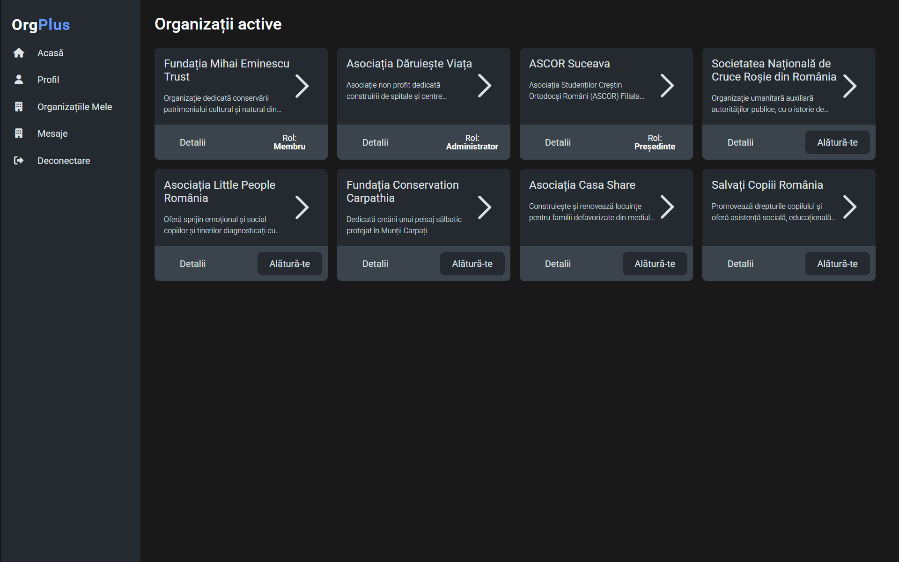
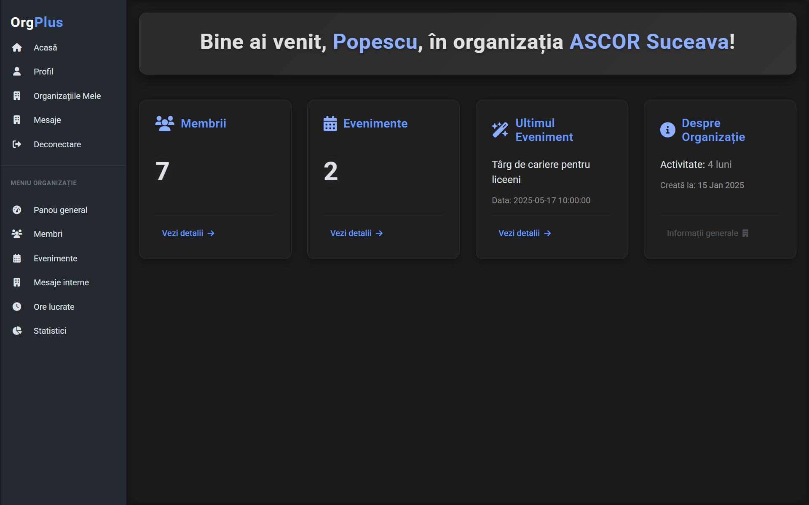
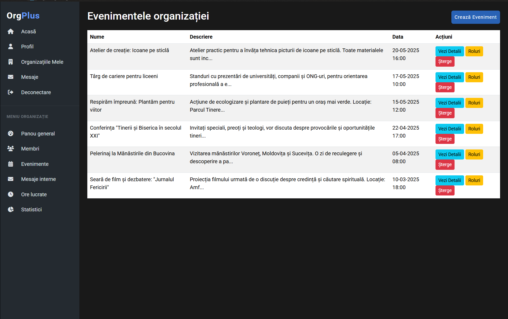

# OrgPlus - Organization Management Platform
<p align="center">
    <span>
        <b>Org<font color="#6399ff">Plus</font></b>
    </span>
</P>
<h3 align="center">Streamline Your Organization's Management, Communication, and Events</h3>

<p align="center">
  OrgPlus is an innovative web platform designed to simplify the management, communication, and coordination of activities within organizations of all sizes. Whether you're running a non-profit, a project team, a company, or even planning a personal event, OrgPlus provides the tools you need for flawless organization.
</p>

---

## Table of Contents

- [About The Project](#about-the-project)
  - [Key Features](#key-features)
  - [Built With](#built-with)
- [Getting Started](#getting-started)
  - [Prerequisites](#prerequisites)
  - [Installation](#installation)
- [Usage](#usage)
- [Testing](#testing)
- [Security Features](#security-features)
- [Roadmap](#roadmap)
- [Author](#author)
- [Acknowledgments](#acknowledgments)

---

## About The Project

<!-- [![Product Screenshot][product-screenshot]](https://example.com) -->


OrgPlus tackles the universal problem of disorganized teams and chaotic event planning. It provides a clear framework for task and role delegation, removing confusion and empowering every team member with a clear understanding of their duties.

Built for versatility, the platform serves everything from intimate event planning like weddings to managing large-scale non-profits. Its standout feature is the ability for a user to join or manage multiple distinct organizations through a single, unified account, streamlining their digital workspace.

### Key Features

-   **Unified Command Center**: A single user profile gives you access to every organization and event you're a part of.
-   **Robust Organization Tools**:
    -   Launch and oversee multiple organizations.
    -   Manage membership through an invitation and request system.
    -   Discover and browse public-facing organizations.
    -   Define clear hierarchies with Owner, Admin, and Member roles.
-   **Dynamic Event Coordination**:
    -   Construct events with custom roles and granular task lists.
    -   Instantly notify all members of new events.
    -   Delegate precise tasks to participants, ensuring accountability.
    -   Maintain privacy with role-based visibility: admins see all tasks, members see only their own.
-   **Volunteer & Contribution Tracking**:
    -   Log and monitor volunteer hours with detailed activity notes.
    -   Easily toggle member status between "active" and "inactive" to reflect current engagement.
    -   Showcase individual contributions through public profiles.
-   **Integrated Communication Hub**:
    -   Handle event and organization invitations in a personal inbox.
    -   Admins can process membership applications from a dedicated organization inbox.
    -   Keep things current with auto-expiring invitations.
-   **Insightful Analytics**:
    -   Get a bird's-eye view of your organization's health from the main dashboard.
    -   Generate in-depth reports on volunteer hours.
    -   Visualize data with dynamic charts showing member engagement and activity trends.
    -   Foster friendly competition with a member contribution leaderboard.


### Built With

This project is built with a combination of robust and modern technologies.

**Backend:**
-   PHP 8.x
-   MySQL (via PDO for database flexibility)
-   Apache Web Server
-   Composer for package management

**Frontend:**
-   HTML5, CSS3, JavaScript
-   Bootstrap 5.3.3
-   SweetAlert2 11 for beautiful, responsive pop-up messages.
-   Chart.js for interactive and clear data visualization.
-   Font Awesome 6.0.0 for icons.

**Development & Testing:**
-   Git & GitHub for version control.
-   PHPUnit 10.0 for automated testing.
-   SQLite for a dedicated testing database.

---

## Getting Started

Follow these instructions to set up the project on your local machine for development and testing purposes.

### Prerequisites

You need a local server environment with PHP, a MySQL database, and Composer. [XAMPP](https://www.apachefriends.org/index.html) is a great option that includes all of these.

-   **PHP** >= 8.0
-   **MySQL/MariaDB**
-   **Composer**: [Install Composer](https://getcomposer.org/download/)

### Installation

1.  **Clone the repository:**
    ```sh
    git clone https://github.com/mateivul/OrganizareONG.git
    cd OrganizareONG
    ```

2.  **Install PHP dependencies:**
    This will install PHPUnit and set up the autoloader.
    ```sh
    composer install
    ```

3.  **Set up the database:**
    -   Open your database management tool (like phpMyAdmin).
    -   Create a new database (e.g., `org_plus`).
    -   Import the database schema from the `org_plus.sql` file into your new database.

4.  **Configure the database connection:**
    -   Open the `src/Config/Database.php` file.
    -   Update the database credentials (`$this->host`, `$this->db_name`, `$this->username`, `$this->password`) to match your local environment.

    ```php
    // src/Config/Database.php

    // ... existing code ...
    class Database
    {
        private $host = 'localhost'; // Your host
        private $db_name = 'org_plus'; // Your database name
        private $username = 'root'; // Your database username
        private $password = ''; // Your database password
        // ... existing code ...
    }
    ```

5.  **Run the application:**
    -   Place the project folder in your web server's document root (e.g., `C:/xampp/htdocs/`).
    -   Start your Apache and MySQL services.
    -   Navigate to `http://localhost/OrganizareONG/public/` in your web browser.

---

## Usage

Once installed, you can start using OrgPlus:

1.  **Register a new account** or log in with an existing one.
2.  **Explore public organizations** on the homepage.
3.  **Create your own organization** or send a request to join an existing one.
4.  Once you are a member of an organization, you can access its **dashboard**, **members list**, **events**, and other features through the sidebar menu.
5.  As an **Administrator or Owner**, you can:
    -   Create events.
    -   Manage member roles.
    -   Add worked hours for members.
    -   Assign specific tasks to participants in an event.




---

## Testing

To guarantee the application's reliability and stability, OrgPlus comes with a comprehensive suite of automated tests. Powered by PHPUnit, these tests execute against a dedicated SQLite database, ensuring that your development data remains untouched.

-   **Automated Test Environment**: The testing environment is bootstrapped automatically. Before any test runs, a fresh database schema is prepared using `org_plus.sqlite.sql`, providing a clean slate for each test run.
-   **Isolated Test Cases**: All tests reside in the `tests/` folder. We leverage PHPUnit's `setUp()` and `tearDown()` methods within test classes to create and destroy test-specific data, which ensures that each test runs independently and predictably.

To run the entire test suite, execute the following command from the project root:

```sh
vendor/bin/phpunit
```
or
```sh
composer test
```
*(You may need to add a "test" script to your `composer.json` file for the second command to work)*

---

## Security Features

Safeguarding user data is fundamental to OrgPlus. We've integrated several key security protocols to create a secure environment:

-   **Secure Password Handling**: We never store passwords as plain text. Instead, we use the robust **SHA256** algorithm combined with a unique salt for each password. This practice renders rainbow table attacks ineffective and protects user credentials.
-   **Defense Against SQL Injection**: The application exclusively uses **PDO Prepared Statements** for all database interactions. This approach ensures that user input is treated strictly as data, never as executable code, neutralizing the threat of SQL injection.
-   **Mitigating Cross-Site Scripting (XSS)**: To prevent malicious scripts from running in users' browsers, all output is sanitized with `htmlspecialchars()`. This function converts special characters into HTML entities, effectively disarming XSS attacks.
-   **Preventing Cross-Site Request Forgery (CSRF)**: To protect against unauthorized commands, all sensitive forms are equipped with unique **CSRF tokens**. These tokens are validated on the server for every request, confirming that the action was intentionally initiated by the authenticated user.
-   **Strict Input Validation**: All incoming data from users undergoes stringent server-side validation. We check for correct data types, formats, and lengths to block malicious or malformed data before it's processed.

---

## Roadmap

OrgPlus has significant potential for growth. Here are some of the features planned for future development:

-   [ ] **Member-Initiated Worked Hours**: Allow members to submit their worked hours for administrator approval.
-   [ ] **Cross-Organization Event Invitations**: Enable inviting users from other organizations to an event.
-   [ ] **Organization Categories**: Introduce categories (e.g., Education, Tech, Non-Profit) to improve organization discovery.
-   [ ] **Advanced Reporting Modules**: Develop more detailed and customizable reports on organization activity.
-   [ ] **External Calendar Integration**: Add the ability to sync OrgPlus events with Google Calendar or Outlook Calendar.

<!-- See the [open issues](https://github.com/mateivul/OrganizareONG/issues) for a full list of proposed features (and known issues). -->

---

## Author

**Vultur Matei**

-   GitHub: [My-github-profile](https://github.com/mateivul)
-   Project Repository: [https://github.com/mateivul/OrganizareONG](https://github.com/mateivul/OrganizareONG)

---

## Acknowledgments

-   [Bootstrap](https://getbootstrap.com/)
-   [SweetAlert2](https://sweetalert2.github.io/)
-   [Chart.js](https://www.chartjs.org/)
-   [Font Awesome](https://fontawesome.com/)
-   [PHPUnit](https://phpunit.de/)

[product-screenshot]: https://via.placeholder.com/800x400/007BFF/FFFFFF?text=OrgPlus+Dashboard+Screenshot
